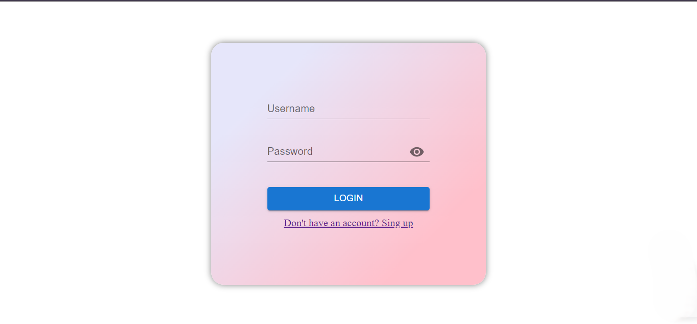
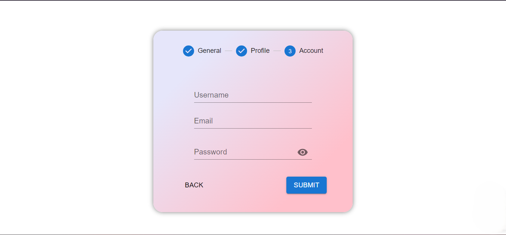

# User Registration and Login Platform

This is a simple user registration and login platform built with React and Material UI. The main purpose of this project was to practice the React Material UI components and implement JWT for session management.

|  |  |
|------------------------------|------------------------------|
| Login form  | Part of singup form   |


## Technologies Used

### Frontend
- **React**: JavaScript library for building user interfaces.
- **Material UI**: A popular React UI framework with pre-built components.
- **Axios**: Promise-based HTTP client for making API requests.

### Backend
- **Express**: Node.js framework for building the server and API routes.
- **JWT (JSON Web Token)**: For secure session management and authentication.
- **Bcrypt**: For hashing and securely storing user passwords.
- **Mongoose**: Object Data Modeling (ODM) library for MongoDB.


## Installation

### Setup

1. **Clone the repository**:
    ```bash
    git clone https://github.com/maduMelo/login-app.git
    cd login-app
    ```

2. **Install dependencies**:

    - **Frontend**:
        ```bash
        cd frontend
        npm install
        ```
    - **Backend**:
        ```bash
        cd backend
        npm install
        ```

3. **Configure environment variables**:

    Create a `.env` file in the `backend` directory and add the following:

    ```env
    DB_USER=your_mongodb_user
    DB_PASS=your_mongodb_connection_pass
    DB_HOST=your_mongodb_host
    DB_NAME=your_mongodb_cluster_name
    TOKEN_SECRET=your_secret
    ```

4. **Run the application**:

    - **Backend**:
        ```bash
        cd backend
        npm start
        ```
    - **Frontend**:
        ```bash
        cd frontend
        npm start
        ```

5. Open your browser and go to `http://localhost:5173`.
